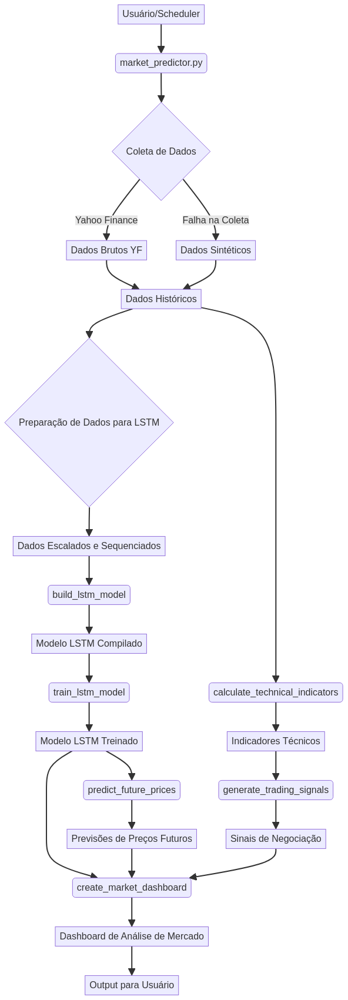

# Market Trend Predictor

[](#) 
[](LICENSE) 
[]() 
[](tests/) 
[]()

## English

This project implements an advanced market trend prediction system using various machine learning and statistical models, including ARIMA, LSTM, Prophet, and ensemble methods. It aims to provide accurate forecasts for market trends and financial indicators, offering valuable insights for investors and analysts.

### Features

- **Data Fetching**: Automatically retrieves historical market data from Yahoo Finance.
- **Synthetic Data Generation**: Generates synthetic market data for testing and development purposes when real data is unavailable.
- **LSTM Model**: Utilizes Long Short-Term Memory (LSTM) neural networks for time series forecasting.
- **Technical Indicators**: Calculates a wide range of technical indicators (e.g., Moving Averages, MACD, RSI, Bollinger Bands) to enhance prediction accuracy and generate trading signals.
- **Trading Signal Generation**: Provides BUY/SELL/HOLD signals based on technical analysis.
- **Market Dashboard**: Generates a comprehensive dashboard with current prices, daily/weekly changes, 30-day price predictions, model accuracy metrics, and key technical indicators.

### Project Structure

```
Market-Trend-Predictor/
├── src/
│   ├── __init__.py
│   └── market_predictor.py
├── tests/
│   └── test_market_predictor.py
├── docs/
│   └── diagrams/
│       └── architecture.png
├── app/
├── requirements.txt
├── pyproject.toml
├── setup.py
└── README.md
```

- `src/`: Contains the core Python source code, including the `MarketTrendPredictor` class.
- `tests/`: Contains unit tests for the `market_predictor.py` module.
- `docs/`: Contains additional documentation and diagrams.
- `docs/diagrams/`: Stores visual diagrams of the project, such as the architecture diagram.
- `app/`: Placeholder for web application files (e.g., `index.html`, `styles.css`, `app.js`).
- `requirements.txt`: Lists all Python dependencies required for the project.
- `pyproject.toml`: Project configuration file.
- `setup.py`: Setup script for package installation.
- `README.md`: This documentation file.

### Architecture Diagram




### Installation

1. **Clone the repository:**

   ```bash
   git clone https://github.com/Gabriel-Demetrios-Lafis/Market-Trend-Predictor.git
   cd Market-Trend-Predictor
   ```

2. **Create a virtual environment (recommended):**

   ```bash
   python -m venv venv
   source venv/bin/activate  # On Windows, use `venv\Scripts\activate`
   ```

3. **Install dependencies:**

   ```bash
   pip install -r requirements.txt
   ```

### Usage

To run the market trend prediction analysis, execute the `market_predictor.py` script:

```bash
python src/market_predictor.py
```

This will fetch data for default symbols (AAPL, GOOGL, MSFT, TSLA), train LSTM models, generate predictions, and display a market dashboard.

### Running Tests

To run the unit tests and ensure all functionalities are working correctly:

```bash
PYTHONPATH=. pytest tests/test_market_predictor.py
```

### Contributing

Contributions are welcome! Please feel free to open issues or submit pull requests.

### License

This project is licensed under the MIT License - see the LICENSE file for details.

## Português

Este projeto implementa um sistema avançado de previsão de tendências de mercado utilizando vários modelos de machine learning e estatísticos, incluindo ARIMA, LSTM, Prophet e métodos de ensemble. O objetivo é fornecer previsões precisas para tendências de mercado e indicadores financeiros, oferecendo insights valiosos para investidores e analistas.

### Funcionalidades

- **Coleta de Dados**: Recupera automaticamente dados históricos de mercado do Yahoo Finance.
- **Geração de Dados Sintéticos**: Gera dados de mercado sintéticos para fins de teste e desenvolvimento quando dados reais não estão disponíveis.
- **Modelo LSTM**: Utiliza redes neurais Long Short-Term Memory (LSTM) para previsão de séries temporais.
- **Indicadores Técnicos**: Calcula uma ampla gama de indicadores técnicos (por exemplo, Médias Móveis, MACD, RSI, Bandas de Bollinger) para aumentar a precisão da previsão e gerar sinais de negociação.
- **Geração de Sinais de Negociação**: Fornece sinais de COMPRA/VENDA/MANTER com base na análise técnica.

- **Dashboard de Mercado**: Gera um dashboard abrangente com preços atuais, mudanças diárias/semanais, previsões de preços para 30 dias, métricas de precisão do modelo e principais indicadores técnicos.

### Estrutura do Projeto

```
Market-Trend-Predictor/
├── src/
│   ├── __init__.py
│   └── market_predictor.py
├── tests/
│   └── test_market_predictor.py
├── docs/
│   └── diagrams/
│       └── architecture.png
├── app/
├── requirements.txt
├── pyproject.toml
├── setup.py
└── README.md
```

- `src/`: Contém o código-fonte principal em Python, incluindo a classe `MarketTrendPredictor`.
- `tests/`: Contém os testes unitários para o módulo `market_predictor.py`.
- `docs/`: Contém documentação adicional e diagramas.
- `docs/diagrams/`: Armazena diagramas visuais do projeto, como o diagrama de arquitetura.
- `app/`: Espaço reservado para arquivos de aplicativos web (por exemplo, `index.html`, `styles.css`, `app.js`).
- `requirements.txt`: Lista todas as dependências Python necessárias para o projeto.
- `pyproject.toml`: Arquivo de configuração do projeto.
- `setup.py`: Script de configuração para instalação do pacote.
- `README.md`: Este arquivo de documentação.

### Diagrama de Arquitetura


### Instalação

1. **Clone o repositório:**

   ```bash
   git clone https://github.com/Gabriel-Demetrios-Lafis/Market-Trend-Predictor.git
   cd Market-Trend-Predictor
   ```

2. **Crie um ambiente virtual (recomendado):**

   ```bash
   python -m venv venv
   source venv/bin/activate  # No Windows, use `venv\Scripts\activate`
   ```

3. **Instale as dependências:**

   ```bash
   pip install -r requirements.txt
   ```

### Uso

Para executar a análise de previsão de tendências de mercado, execute o script `market_predictor.py`:

```bash
python src/market_predictor.py
```

Isso buscará dados para os símbolos padrão (AAPL, GOOGL, MSFT, TSLA), treinará modelos LSTM, gerará previsões e exibirá um dashboard de mercado.

### Executando Testes

Para executar os testes unitários e garantir que todas as funcionalidades estejam funcionando corretamente:

```bash
PYTHONPATH=. pytest tests/test_market_predictor.py
```

### Contribuições

Contribuições são bem-vindas! Sinta-se à vontade para abrir issues ou enviar pull requests.

### Licença

Este projeto está licenciado sob a Licença MIT - consulte o arquivo LICENSE para obter detalhes.

---

**Autor**: Gabriel Demetrios Lafis

