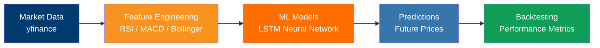

# Market Trend Predictor

[](https://www.python.org/)
[](https://www.tensorflow.org/)
[](https://scikit-learn.org/)
[](https://pypi.org/project/yfinance/)
[](LICENSE)

[Portugues](#portugues) | [English](#english)

---

## Portugues

Preditor de precos de acoes baseado em LSTM com indicadores tecnicos.



### O que faz

Arquivo unico (`market_predictor.py`, ~394 linhas) que:

- Busca dados historicos de acoes via yfinance (ou gera dados sinteticos como fallback)
- Treina uma rede neural LSTM para previsao de precos
- Calcula indicadores tecnicos: RSI, MACD, Bollinger Bands, medias moveis
- Preve precos futuros com o modelo treinado
- Gera sinais de trading baseados em analise tecnica

### Como usar

```bash
# Clonar o repositorio
git clone https://github.com/galafis/Market-Trend-Predictor.git
cd Market-Trend-Predictor

# Criar ambiente virtual e instalar dependencias
python -m venv venv
source venv/bin/activate  # Windows: venv\Scripts\activate
pip install -r requirements.txt

# Executar
python market_predictor.py
```

### Testes

```bash
pytest tests/test_market_predictor.py -v
```

### Estrutura

```
Market-Trend-Predictor/
├── market_predictor.py    # Codigo principal (LSTM, indicadores, sinais)
├── tests/
│   └── test_market_predictor.py
├── requirements.txt
├── LICENSE
└── README.md
```

### Stack

| Tecnologia | Uso |
|---|---|
| Python | Linguagem principal |
| TensorFlow/Keras | Rede neural LSTM |
| scikit-learn | Pre-processamento (MinMaxScaler), metricas |
| yfinance | Dados de mercado |
| pandas / numpy | Manipulacao de dados |
| matplotlib / seaborn | Visualizacao |

---

## English

LSTM-based stock price predictor with technical indicators.

### What it does

Single file (`market_predictor.py`, ~394 lines) that:

- Fetches historical stock data via yfinance (or generates synthetic data as fallback)
- Trains an LSTM neural network for price prediction
- Calculates technical indicators: RSI, MACD, Bollinger Bands, moving averages
- Predicts future prices with the trained model
- Generates trading signals based on technical analysis

### Usage

```bash
# Clone the repository
git clone https://github.com/galafis/Market-Trend-Predictor.git
cd Market-Trend-Predictor

# Create virtual environment and install dependencies
python -m venv venv
source venv/bin/activate  # Windows: venv\Scripts\activate
pip install -r requirements.txt

# Run
python market_predictor.py
```

### Tests

```bash
pytest tests/test_market_predictor.py -v
```

### Structure

```
Market-Trend-Predictor/
├── market_predictor.py    # Main code (LSTM, indicators, signals)
├── tests/
│   └── test_market_predictor.py
├── requirements.txt
├── LICENSE
└── README.md
```

### Stack

| Technology | Usage |
|---|---|
| Python | Primary language |
| TensorFlow/Keras | LSTM neural network |
| scikit-learn | Preprocessing (MinMaxScaler), metrics |
| yfinance | Market data |
| pandas / numpy | Data manipulation |
| matplotlib / seaborn | Visualization |

---

## Author

**Gabriel Demetrios Lafis**
- GitHub: [@galafis](https://github.com/galafis)
- LinkedIn: [Gabriel Demetrios Lafis](https://linkedin.com/in/gabriel-demetrios-lafis)

## License

MIT License - see [LICENSE](LICENSE) for details.
