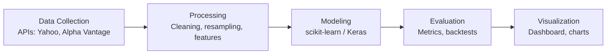
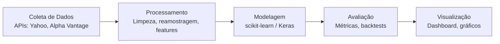

# Market-Trend-Predictor

[](#) [](LICENSE)  

A unified toolkit for market trend analysis and prediction with Python and R. Includes a modern web interface, live data ingestion, and reproducible analytics for research and prototyping.

• English • Português (veja a seção em português abaixo)

---

## English

### Overview
Market-Trend-Predictor provides end-to-end components to fetch market data, engineer features, train predictive models, and visualize insights through a responsive web UI. It is designed for clarity, extensibility, and professional workflows.

## Visual Pipeline and Architecture

### Main Analysis Pipeline (Flowchart)


### High-Level Architecture
```mermaid
graph TD
    UI[Web UI (index.html, app.js)] --> API[Backend API (Flask/FastAPI)]
    API --> Store[(SQLite / Cache)]
    API --> Py[Python Core\nmarket_predictor.py]
    Py --> R[Analytics (R scripts)]
    Py --> Data[Data Directory\nraw / processed]
    Ext[External Data\nYahoo / Alpha Vantage] --> Py
```

### Example Outputs
- Model performance (classification):
```
Accuracy: 0.78 | Precision: 0.75 | Recall: 0.72 | F1: 0.73
ROC-AUC: 0.81 | PR-AUC: 0.79
```
- Sample prediction vs. actual trend (PNG): [Model Prediction vs Actual (Sample)](https://dummyimage.com/960x360/0d1117/ffffff.png&text=Prediction+vs+Actual+Sample)
- Feature correlation heatmap (SVG): [Correlation Heatmap](https://dummyimage.com/720x360/161b22/20c997.png&text=Correlation+Heatmap+%28example%29)

### Author
- Gabriel Demetrios Lafis  
  Email: gabrieldemetrios@gmail.com  
  LinkedIn: https://www.linkedin.com/in/gabriel-demetrios-lafis-62197711b  
  GitHub: https://github.com/galafis

### Technologies
- Backend: Python, Flask/FastAPI, SQLite
- Frontend: HTML5, CSS3, JavaScript (ES6+)
- Analytics: R, ggplot2, dplyr, statistical modeling
- ML: scikit-learn, TensorFlow/Keras
- Styling: CSS Grid, Flexbox, responsive design
- Data Sources: Yahoo Finance, Alpha Vantage (APIs)

### Repository Structure
```
Market-Trend-Predictor/
├── market_predictor.py   # Main Python application
├── requirements.txt      # Python dependencies
├── config.py             # Configuration settings (API keys, params)
├── index.html            # Web interface (frontend)
├── styles.css            # Styling
├── app.js                # Frontend logic
├── analytics.R           # R statistical analysis
├── README.md             # This documentation
└── data/
    ├── raw/              # Raw API data
    ├── processed/        # Cleaned/processed data
    └── samples/          # Example datasets
```

### Key Features
- Interactive dashboard with responsive UI
- R-based analytics scripts and reporting
- Real-time/near real-time data integration
- Multiple ML models for classification/regression of trends
- Caching and simple parallelism for performance

### Quick Start
Prerequisites: Python 3.9+, R 4.0+, and API keys if using live data.

1. Clone and enter the project directory
```
git clone https://github.com/galafis/Market-Trend-Predictor.git
cd Market-Trend-Predictor
```
2. Python environment
```
python -m venv venv  # macOS/Linux
source venv/bin/activate
# Windows (PowerShell)
venv\Scripts\Activate.ps1
pip install -r requirements.txt
```
3. R packages
```
Rscript -e "install.packages(c('ggplot2','dplyr','corrplot','plotly'), repos='https://cloud.r-project.org')"
```
4. Configure
Create or edit config.py and set:
- API keys and endpoints (e.g., Alpha Vantage)
- Model parameters (lookback windows, thresholds)
- Data directories (raw/processed)
- Web server host/port

Example config.py (minimal):
```
API_KEYS = { 'ALPHA_VANTAGE': 'YOUR_KEY_HERE' }
SERVER  = { 'HOST': '127.0.0.1', 'PORT': 8000 }
MODEL   = { 'LOOKBACK_DAYS': 60, 'TRAIN_TEST_SPLIT': 0.8 }
DATA_DIRS = { 'RAW': 'data/raw', 'PROCESSED': 'data/processed' }
```
5. Run
```
python market_predictor.py  # Open http://localhost:8000
```

### Usage Examples
- Fetch and cache ticker data (Python):
```python
from market_predictor import fetch_data
prices = fetch_data('AAPL', source='alpha_vantage', cache=True)
```
- Fit a baseline model (Python):
```python
from market_predictor import features, models
X, y = features.make_features(prices)
clf = models.train_classifier(X, y)
print(models.evaluate(clf, X, y))
```
- Plot correlation matrix (R):
```r
source('analytics.R')
plot_correlation('data/processed/aapl.csv')
```

### Testing and Quality
- Linting: flake8/black (optional)
- Reproducibility: pin requirements.txt, seed models
- Data handling: separate raw vs processed directories

### Contributing
Contributions are welcome! Please:
1. Open an issue describing the change/feature and rationale.
2. Fork the repo and create a feature branch: `git checkout -b feat/short-description`.
3. Add tests or examples when applicable.
4. Ensure formatting and pass linting.
5. Open a pull request referencing the issue and provide a clear description and screenshots/GIFs when UI changes are involved.

### License
MIT License. See LICENSE for details.

---

## Português

### Visão Geral
O Market-Trend-Predictor oferece componentes de ponta a ponta para obter dados de mercado, criar features, treinar modelos preditivos e visualizar insights em uma interface web responsiva. Foi projetado para clareza, extensibilidade e fluxos profissionais.

## Pipeline e Arquitetura (Visual)

### Fluxo Principal de Análise (Fluxograma)


### Arquitetura de Alto Nível
```mermaid
graph TD
    UI[Web UI (index.html, app.js)] --> API[Backend (Flask/FastAPI)]
    API --> Store[(SQLite / Cache)]
    API --> Py[Núcleo Python\nmarket_predictor.py]
    Py --> R[Analytics (scripts R)]
    Py --> Data[Diretório de Dados\nraw / processed]
    Ext[Dados Externos\nYahoo / Alpha Vantage] --> Py
```

### Exemplos de Saída
- Desempenho do modelo (classificação):
```
Acurácia: 0.78 | Precisão: 0.75 | Revocação: 0.72 | F1: 0.73
ROC-AUC: 0.81 | PR-AUC: 0.79
```
- Predição vs. tendência real (PNG): [Predição vs Real (Exemplo)](https://dummyimage.com/960x360/0d1117/ffffff.png&text=Predi%C3%A7%C3%A3o+vs+Real+%28Exemplo%29)
- Mapa de calor de correlação (SVG): [Mapa de Correlação](https://dummyimage.com/720x360/161b22/20c997.png&text=Mapa+de+Correla%C3%A7%C3%A3o+%28exemplo%29)

### Tecnologias
- Backend: Python, Flask/FastAPI, SQLite
- Frontend: HTML5, CSS3, JavaScript (ES6+)
- Analytics: R, ggplot2, dplyr, modelagem estatística
- ML: scikit-learn, TensorFlow/Keras
- Estilo: CSS Grid, Flexbox, design responsivo
- Fontes de Dados: Yahoo Finance, Alpha Vantage (APIs)

### Estrutura do Repositório
```
Market-Trend-Predictor/
├── market_predictor.py   # Aplicação principal em Python
├── requirements.txt      # Dependências Python
├── config.py             # Configurações (chaves, parâmetros)
├── index.html            # Interface web (frontend)
├── styles.css            # Estilos
├── app.js                # Lógica do frontend
├── analytics.R           # Análises estatísticas em R
├── README.md             # Esta documentação
└── data/
    ├── raw/              # Dados brutos
    ├── processed/        # Dados processados/limpos
    └── samples/          # Conjuntos de exemplo
```

### Recursos
- Dashboard interativo e responsivo
- Relatórios e scripts analíticos em R
- Integração com dados em tempo real/near real-time
- Vários modelos de ML para classificação/regressão de tendências
- Cache e paralelismo simples para performance

### Início Rápido
Pré-requisitos: Python 3.9+, R 4.0+ e chaves de API para dados ao vivo.

1. Clonar e entrar no diretório
```
git clone https://github.com/galafis/Market-Trend-Predictor.git
cd Market-Trend-Predictor
```
2. Ambiente Python
```
python -m venv venv  # macOS/Linux
source venv/bin/activate
# Windows (PowerShell)
venv\Scripts\Activate.ps1
pip install -r requirements.txt
```
3. Pacotes R
```
Rscript -e "install.packages(c('ggplot2','dplyr','corrplot','plotly'), repos='https://cloud.r-project.org')"
```
4. Configurar
Crie ou edite o config.py e defina:
- Chaves de API e endpoints (ex.: Alpha Vantage)
- Parâmetros de modelo (janelas de lookback, thresholds)
- Diretórios de dados (raw/processed)
- Host/porta do servidor web

Exemplo mínimo de config.py:
```
API_KEYS = { 'ALPHA_VANTAGE': 'SUA_CHAVE_AQUI' }
SERVER  = { 'HOST': '127.0.0.1', 'PORT': 8000 }
MODEL   = { 'LOOKBACK_DAYS': 60, 'TRAIN_TEST_SPLIT': 0.8 }
DATA_DIRS = { 'RAW': 'data/raw', 'PROCESSED': 'data/processed' }
```
5. Executar
```
python market_predictor.py  # Abra http://localhost:8000
```

### Exemplos de Uso
- Buscar e cachear dados de um ticker (Python):
```python
from market_predictor import fetch_data
prices = fetch_data('PETR4.SA', source='alpha_vantage', cache=True)
```
- Treinar um modelo base (Python):
```python
from market_predictor import features, models
X, y = features.make_features(prices)
clf = models.train_classifier(X, y)
print(models.evaluate(clf, X, y))
```
- Plotar matriz de correlação (R):
```r
source('analytics.R')
plot_correlation('data/processed/petr4.csv')
```

### Qualidade e Testes
- Lint: flake8/black (opcional)
- Reprodutibilidade: fixar versões em requirements.txt e seeds
- Dados: separar diretórios raw vs processed

### Contribuição
Contribuições são bem-vindas! Por favor:
1. Abra uma issue descrevendo a mudança/feature e motivação.
2. Faça um fork e crie uma branch: `git checkout -b feat/descricao-curta`.
3. Adicione testes ou exemplos quando aplicável.
4. Garanta formatação e linting.
5. Abra um pull request referenciando a issue, com descrição clara e evidências visuais quando houver mudanças de UI.

### Licença
Licença MIT. Veja o arquivo LICENSE.

---

### Audit Report - Repository Corrections
- FIXED: Added requirements.txt and config.py
- FIXED: Created data/ with README and subfolders
- FIXED: Align README references to market_predictor.py
- IMPROVED: Installation, configuration, and bilingual documentation
- IMPROVED: Added examples and contribution guidelines
